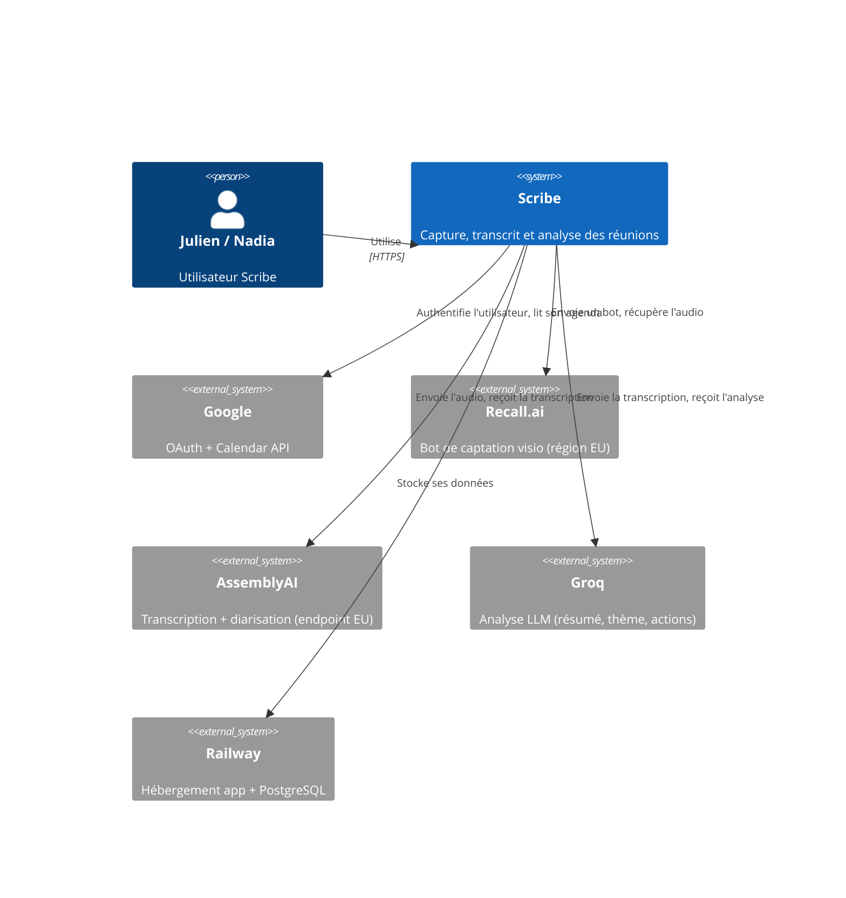
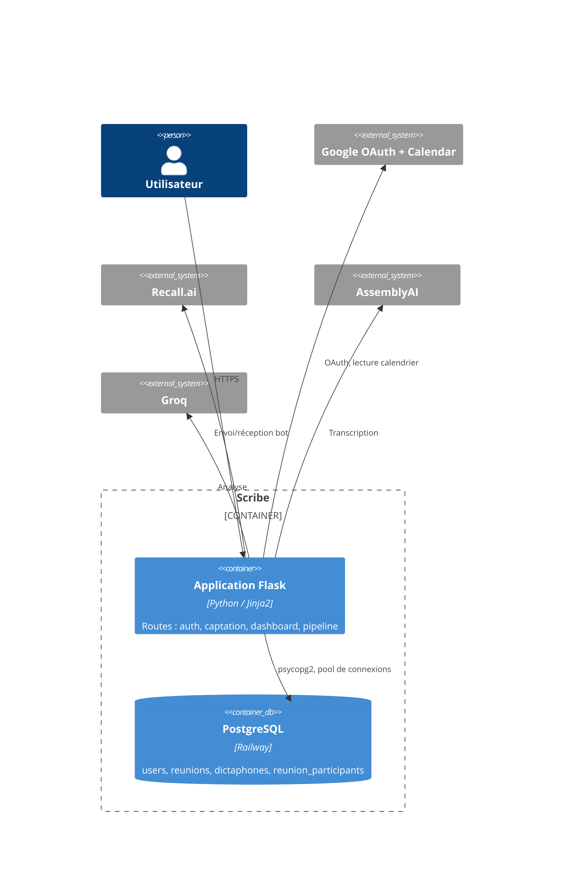
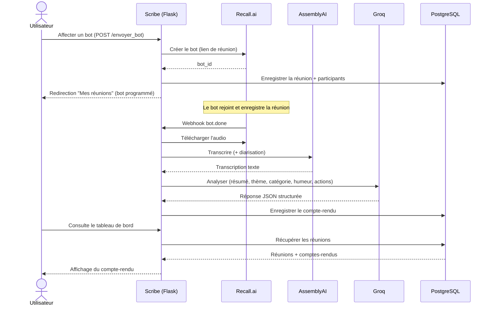

# Dossier de cadrage — Scribe

## 6.1) Dossier de cadrage

### 6.1.1) Vision produit

**Elevator pitch**

Prendre des notes pendant une réunion empêche d'y participer vraiment. On
écoute à moitié, on note mal, et l'essentiel se perd. Scribe est un
assistant de réunion qui s'en charge à votre place. Il capte l'audio, le
transcrit en identifiant qui parle, et produit automatiquement un
compte-rendu structuré : résumé, thème, ton de l'échange et liste des
actions décidées.

Sa particularité est de couvrir les deux réalités du travail d'aujourd'hui.
À distance, Scribe se connecte à votre agenda et envoie un bot silencieux
capter vos visioconférences. En présentiel, l'application se transforme en
dictaphone. Dans les deux cas, le traitement est identique et le
compte-rendu arrive sans que vous ayez rien à faire. Avec Scribe, vous
entrez en réunion et vous en ressortez avec le compte-rendu déjà écrit.

**Critères de succès**

- **Gain de temps.** Réduction du temps passé à rédiger et diffuser un
  compte-rendu après une réunion : le compte-rendu se génère seul, sans
  action de l'utilisateur après la fin de la réunion.
- **Fiabilité.** La transcription reste exploitable en conditions réelles
  grâce à la diarisation (attribution des propos à un locuteur), activée
  aussi bien en visio qu'en dictaphone.
- **Adoption.** L'application donne envie d'être réutilisée. L'indicateur
  retenu est la consultation de l'historique des réunions depuis le
  tableau de bord.
- **Conformité RGPD.** Une réunion enregistrée contient des voix, donc des
  données personnelles. Le succès se mesure au recueil explicite du
  consentement avant tout traitement, matérialisé par un écran de
  consentement bloquant en production.

### 6.1.2) Personae & parcours

**Persona 1 — Julien, manager en télétravail**
38 ans, manage une équipe de 7 personnes, travaille à distance 4 jours sur
5. Enchaîne 4 à 5 visioconférences par jour sur Teams et Google Meet.
Frustration : il passe 30 minutes après chaque réunion à rédiger le
compte-rendu, et les décisions prises sont souvent oubliées faute d'avoir
été notées sur le moment. Attente : recevoir un compte-rendu fiable sans y
penser, et retrouver facilement ce qui a été décidé la semaine dernière.

*Journey map — mode visio*

| Étape | Ce qu'il fait | Ce qu'il ressent |
|---|---|---|
| Avant | Reçoit l'invitation dans son agenda Google | Neutre |
| Préparation | Ouvre Scribe, voit ses réunions à venir sur la page "Mes réunions", clique sur "Affecter un bot" pour celle qu'il veut enregistrer | Rassuré : il choisit réunion par réunion, rien n'est automatique |
| Consentement | Valide l'écran de consentement RGPD (bloquant, à l'inscription) | Serein : il sait qu'il est en règle |
| Pendant | Le bot ("Bot Scribe") rejoint la réunion sous un nom visible par tous. Julien participe sans prendre de notes | Concentré, disponible |
| Après | Ne fait rien. Le compte-rendu se génère seul dès la fin de la réunion | Soulagé |
| Consultation | Retrouve le compte-rendu dans son tableau de bord | Convaincu |

**Persona 2 — Nadia, chef de projet en présentiel**
31 ans, chef de projet en agence, la plupart de ses réunions se tiennent en
salle avec ses clients. Frustration : prendre des notes face à un client
dégrade la relation, elle doit choisir entre écouter et écrire. Attente :
enregistrer discrètement et obtenir un compte-rendu propre, sans matériel
ni installation.

*Journey map — mode dictaphone*

| Étape | Ce qu'elle fait | Ce qu'elle ressent |
|---|---|---|
| Avant | Ouvre Scribe sur son ordinateur ou son téléphone | Simple |
| Consentement | A déjà validé l'écran de consentement à son inscription ; informe verbalement les participants présents avant de lancer l'enregistrement | Rassurée : la démarche est cadrée |
| Lancement | Appuie sur le micro, pose l'appareil | Libérée |
| Pendant | Écoute et échange sans écrire | Pleinement présente |
| Fin | Arrête l'enregistrement, nomme la séance | Sans effort |
| Résultat | Consulte le résumé et les actions générés sur son tableau de bord | Impressionnée |

Le point commun : les deux parcours divergent au moment de la captation
(bot pour Julien, micro pour Nadia), puis convergent — le traitement et le
format du compte-rendu sont strictement identiques.

### 6.1.3) Carte des user-stories

| Brique | User story | Priorité | Palier |
|---|---|---|---|
| Captation | En tant qu'utilisateur, je veux enregistrer une réunion en présentiel depuis mon navigateur, afin de garder une trace sans matériel. | Must have | Socle |
| Captation | En tant qu'utilisateur, je veux qu'un bot rejoigne ma visioconférence et l'enregistre, afin de ne pas avoir à le faire moi-même. | Should have | Avancé |
| Transcription | En tant qu'utilisateur, je veux que l'audio soit converti en texte, afin de disposer d'une trace écrite. | Must have | Socle |
| Transcription | En tant qu'utilisateur, je veux savoir qui a dit quoi, afin de comprendre les échanges et les positions de chacun. | Should have | Cible |
| Analyse | En tant qu'utilisateur, je veux un résumé et le ton général de la réunion, afin d'en saisir rapidement l'essentiel. | Must have | Socle |
| Analyse | En tant qu'utilisateur, je veux un compte-rendu structuré avec le thème, la catégorie et la liste des actions décidées, afin d'assurer un suivi opérationnel. | Should have | Cible |
| Architecture | En tant qu'utilisateur, je veux connecter mon agenda une seule fois, afin que Scribe retrouve mes réunions automatiquement. | Should have | Cible |
| Architecture | En tant qu'utilisateur, je veux que le compte-rendu se génère seul à la fin de la réunion, afin de ne pas avoir à revenir le demander. | Should have | Avancé |
| Tableau de bord | En tant qu'utilisateur, je veux voir la liste de mes réunions passées et ouvrir chaque compte-rendu, afin de retrouver l'information. | Must have | Socle |
| Tableau de bord | En tant qu'utilisateur, je veux filtrer mes réunions par type, catégorie et période, afin d'analyser mes tendances. | Should have | Cible |
| RGPD | En tant qu'utilisateur, je veux être informé et donner mon accord avant tout enregistrement, afin que mes droits soient respectés. | Must have | Socle |
| RGPD | En tant qu'utilisateur, je veux pouvoir supprimer définitivement mes données personnelles, afin d'exercer mon droit à l'effacement. | Could have | Avancé |

### 6.1.4) État de l'art / benchmark

Comparatif détaillé disponible dans [`BENCHMARK.md`](BENCHMARK.md) (4
familles : transcription avec diarisation, LLM pour résumé/actions,
approche de classification, bot réunion). Choix retenus :

- **Transcription : AssemblyAI** (Universal-2). Le moins cher des trois
  candidats une fois la diarisation incluse (~0,17 $/h), endpoint européen
  disponible et utilisé (`api.eu.assemblyai.com`).
- **LLM : Groq — openai/gpt-oss-120b.** Moins cher à l'entrée que les
  alternatives comparées (0,15 $/M tokens), vitesse d'inférence élevée,
  sortie JSON structurée fiable.
- **Classification : intégrée au LLM.** Un seul appel Groq produit thème,
  catégorie, humeur, résumé et actions — pas de coût ni de modèle
  supplémentaire.
- **Bot réunion : Recall.ai.** Compatibilité universelle
  (Meet/Zoom/Teams/Slack/Webex) et conformité RGPD (hébergement EU),
  sans nécessiter d'auto-hébergement.

### 6.1.5) Analyse RGPD & Éthique IA

Scribe traite des enregistrements de réunions : des voix (données
biométriques), des propos identifiables, des informations parfois
confidentielles. La conformité n'est pas une formalité, c'est une
contrainte de conception.

**Consentement et transparence**

Un enregistrement ne peut pas se faire à l'insu des participants.

- **En présentiel (dictaphone) :** l'utilisateur doit avoir validé un écran
  de consentement RGPD bloquant lors de son inscription — sans cette
  validation, aucune page de l'application n'est accessible.
- **En visioconférence (bot) :** le bot rejoint sous un nom explicite
  ("Bot Scribe"), visible par tous les participants dans l'interface de
  visio. L'organisateur qui programme le bot voit un rappel explicite au
  moment de l'affectation, l'invitant à s'assurer que les participants ont
  été informés.
- **Choix de conception assumé :** le bot n'est jamais envoyé
  automatiquement sur toutes les réunions de l'agenda. L'utilisateur
  choisit réunion par réunion.

Le consentement recueilli protège l'utilisateur inscrit sur Scribe
(organisateur ou opérateur du dictaphone) ; informer les autres
participants présents reste une démarche portée par cet utilisateur,
rappelée explicitement dans l'interface au moment de la captation.

**Durée de conservation et droit à l'effacement**

- **Rétention.** Les fichiers audio bruts ne sont jamais conservés
  au-delà du traitement : ils sont supprimés du serveur immédiatement
  après la fin du pipeline (transcription + analyse), que celui-ci
  réussisse ou échoue.
- **Effacement.** La suppression d'un compte retire définitivement les
  données personnelles de l'utilisateur (nom, email). Une réunion visio
  pouvant être partagée entre plusieurs utilisateurs Scribe (l'organisateur
  et les autres participants qui y sont automatiquement rattachés), les
  comptes-rendus restent disponibles pour les participants restants après
  la suppression du compte de l'un d'entre eux, sans plus comporter aucune
  donnée permettant d'identifier la personne ayant supprimé son compte.

**Sous-traitants et article 28**

Scribe fait appel à Recall.ai (captation à distance), AssemblyAI
(transcription) et Groq (analyse), ainsi qu'à Google (authentification et
lecture de calendrier) et Railway (hébergement et base de données). Au
sens du RGPD, Scribe est responsable de traitement et ces services sont
sous-traitants. Chacun est documenté dans `dpa.txt` : rôle, données
transmises, et localisation — y compris la précision que l'hébergement
Railway du projet est en région US, ce qui implique un transfert
international pour l'ensemble des données stockées, indépendamment de la
localisation européenne choisie pour Recall.ai et AssemblyAI.

**Mesures par palier**

| Palier | Mesures RGPD | État |
|---|---|---|
| Socle | Données personnelles identifiées et documentées. Consentement mentionné explicitement. Durée de conservation définie. | Validé |
| Cible | Écran de consentement intégré à l'interface. Analyse de risques liée aux données biométriques. Registre de traitement simplifié. | Écran de consentement et registre simplifié en place ; analyse de risques formelle non rédigée |
| Avancé | Consentement bloquant en production. Droit à l'effacement codé et fonctionnel. Transcriptions anonymisées en base. DPA formellement validés avec les trois prestataires. | Consentement bloquant et droit à l'effacement livrés ; anonymisation et DPA formels non réalisés |

Le palier formellement revendiqué pour cette brique est **Socle**, validé
sans réserve. Les mesures de niveau Avancé déjà en place (consentement
bloquant, droit à l'effacement) constituent une marge au-delà de ce qui
est requis pour ce palier.

### 6.1.6) Roadmap de haut niveau

**Release plan**

| Sprint | Objectif | Livrable |
|---|---|---|
| Sprint 1 | Socle complet | Dictaphone fonctionnel, transcription, résumé, tableau de bord simple, persistance |
| Sprint 2 | Cible | Bot de réunion, connexion à l'agenda, diarisation, compte-rendu structuré, filtres |
| Sprint 3 | Avancé | Traitement automatique de bout en bout, consentement bloquant, droit à l'effacement |
| Sprint 4 | Stabilisation | Tests, linting, déploiement |

Le socle a été intégralement livré avant l'engagement de toute story de
palier supérieur.

**Backlog Sprint 1**

| ID | Brique | Tâche | Critères d'acceptation |
|---|---|---|---|
| T1.1 | Architecture | Initialisation du projet | Dépôt Git créé, environnement virtuel Python configuré, vérification automatique du style de code en place, README rédigé |
| T1.2 | Interface | Squelette de l'application | Menu de navigation (Dictaphone, Mes réunions, Tableau de bord). Charte graphique définie |
| T1.3 | RGPD | Écran de consentement | Case à cocher obligatoire avant toute capture. Sans validation, l'enregistrement ne démarre pas |
| T1.4 | Captation | Capture audio par le micro | Enregistrement depuis le navigateur, fichier audio récupéré et validé côté serveur |
| T1.5 | Transcription | Intégration de la transcription | Envoi du fichier audio au service de transcription, récupération et affichage du texte |
| T1.6 | Analyse | Résumé par le modèle de langage | Prompt rédigé, transcription envoyée, résumé affiché à l'écran |
| T1.7 | Données | Persistance | Base de données créée. Date, résumé et transcription sauvegardés et rattachés à l'utilisateur |
| T1.8 | Tableau de bord | Liste des réunions | Vue listant les enregistrements passés, chacun ouvrant son compte-rendu |
| T1.9 | Qualité | Tests unitaires | Tests sur les fonctions non liées à l'IA |

Total estimé : 8 jours-homme sur une capacité de 20 (4 personnes × 5
jours), soit une marge volontaire pour absorber les imprévus
d'intégration.

### 6.1.7) Plan de risques

Probabilité et impact évalués sur trois niveaux : Faible, Moyen, Fort.

| # | Catégorie | Risque | Prob. | Impact | Mesures |
|---|---|---|---|---|---|
| 1 | Financier | Dépassement du budget API sur des audios longs | Moyenne | Fort | Prévention : tests limités à des réunions courtes, alertes de facturation activées chez les trois prestataires. Correction : plafond de durée par réunion. |
| 2 | Technique | Latence de traitement trop élevée, l'utilisateur attend | Moyenne | Fort | Prévention : indicateurs de chargement dans l'interface. Correction : traitement en arrière-plan (threads), l'application répond immédiatement et le compte-rendu se remplit ensuite ; pool de connexions à la base pour réduire la latence des pages. |
| 3 | Technique | Le bot n'arrive pas à rejoindre les visioconférences | Moyenne | Fort | Prévention : recours à un prestataire spécialisé (Recall.ai) qui maintient la compatibilité. Correction : le mode dictaphone sert de solution de secours et garantit un socle fonctionnel. |
| 4 | Technique | Qualité de séparation des voix insuffisante | Moyenne | Moyen | Prévention : validation du service de transcription sur des échantillons réels avant engagement. Correction : repli sur un texte brut sans identification des locuteurs. |
| 5 | Technique | Compte-rendu perdu ou vide malgré une captation réussie | Moyenne | Moyen | Prévention : logs applicatifs détaillés sur chaque étape du pipeline, consultables en production, permettant un diagnostic rapide en cas d'échec silencieux d'un service tiers. |
| 6 | Technique | Échec de la connexion à l'agenda de l'utilisateur | Faible | Moyen | Correction : saisie manuelle du lien de la réunion possible en secours. |
| 7 | Juridique | Non-conformité RGPD : consentement non recueilli | Faible | Fort | Prévention : écran de consentement bloquant, sans validation aucun enregistrement n'est possible. |
| 8 | Technique | Panne d'un prestataire pendant la soutenance | Faible | Fort | Prévention : vidéo de démonstration enregistrée à l'avance pour sécuriser la présentation. |
| 9 | Humain | Effet tunnel : l'équipe s'enlise sur une fonctionnalité secondaire et rate le socle | Moyenne | Fort | Prévention : sprints courts, backlog du Sprint 1 conçu pour livrer et geler le socle avant toute story de palier supérieur. |

### 6.1.8) Plan qualité

**Normes de code et métriques cibles**

- **Style.** Le code Python respecte la norme PEP 8, vérifié
  automatiquement par flake8 (`setup.cfg`), zéro erreur.
- **Documentation.** Les fonctions portent un commentaire lorsque leur
  comportement n'est pas évident à la lecture (contrainte cachée,
  contournement, choix de conception), pas de documentation systématique
  qui risquerait de devenir obsolète.
- **Performance.** Le temps de réponse des pages consultant la base est
  optimisé via un pool de connexions.

**Stratégie de tests**

- **Tests unitaires.** Couverture de la logique métier non liée à l'IA
  (formatage de transcription, requêtes en base, appel au bot de
  captation), avec les appels externes systématiquement simulés (mocks) —
  aucun appel réel à Groq, AssemblyAI ou Recall.ai dans la suite de tests,
  ce qui la rend gratuite, rapide et reproductible.
- **Palier retenu.** Socle : tests unitaires sur la logique non-IA et
  linting PEP8.

**Revue de code et intégration continue**

- **Branches.** Aucun envoi direct sur la branche principale. Chaque
  fonctionnalité est développée sur une branche dédiée.
- **Revue obligatoire.** Toute fusion passe par une pull request.
- **Déploiement.** Automatisé : chaque fusion sur la branche principale
  déclenche un redéploiement sur Railway, où la base de données est déjà
  hébergée.

## 6.2) Spécifications & architecture

### 6.2.1) Diagrammes C4

**Contexte système**

**Conteneurs**

L'application est un monolithe Flask server-rendered (pas d'API séparée
d'un front SPA), architecture choisie pour rester simple à maintenir pour
une équipe réduite. La logique de traitement (transcription, analyse,
écriture en base) est isolée dans une fonction unique, appelée
indifféremment que la source audio soit une visioconférence ou un
dictaphone.

### 6.2.2) Modèle de données

**Table USER**

| Attribut | Type | Obligatoire | Description |
|---|---|---|---|
| id_user | UUID | Oui (PK) | Identifiant unique, généré automatiquement |
| nom | VARCHAR | Non | Nom complet récupéré via la connexion Google |
| email | VARCHAR | Oui (unique) | Email Google, sert de clé d'identification |
| consentement_date | TIMESTAMP | Non | Date de validation de l'écran de consentement RGPD ; nulle tant que non validée, bloque l'accès à l'application |

**Table REUNION**

| Attribut | Type | Obligatoire | Description |
|---|---|---|---|
| id_reunion | UUID | Oui (PK) | Identifiant unique de la réunion |
| id_user | UUID | Non (FK) | Utilisateur propriétaire ; devient nul si ce dernier supprime son compte, pour que les autres participants gardent accès au compte-rendu |
| titre | VARCHAR | Non | Titre de la réunion, issu du calendrier |
| date | TIMESTAMP | Non | Date et heure de la réunion |
| duree_secondes | INT | Non | Durée de la réunion en secondes |
| participants | TEXT | Non | Liste des participants (sérialisée en JSON) |
| theme | VARCHAR | Non | Thème principal, généré par le LLM |
| categorie | VARCHAR | Non | Catégorie choisie dans une liste fermée par le LLM |
| humeur | VARCHAR | Non | Humeur de l'échange, valeur imposée au LLM |
| resume | TEXT | Non | Résumé de la réunion, généré par le LLM |
| actions | TEXT | Non | Liste des actions à faire (sérialisée en JSON) |
| recall_bot_id | VARCHAR | Non | Identifiant du bot Recall, clé de jointure du webhook |

**Table DICTAPHONE**

| Attribut | Type | Obligatoire | Description |
|---|---|---|---|
| id_dictaphone | UUID | Oui (PK) | Identifiant unique de l'enregistrement |
| id_user | UUID | Non (FK) | Utilisateur propriétaire ; devient nul si ce dernier supprime son compte |
| titre | VARCHAR | Non | Titre auto-généré, modifiable |
| date | TIMESTAMP | Non | Date et heure de l'enregistrement |
| duree_secondes | INT | Non | Durée en secondes |
| theme | VARCHAR | Non | Thème principal, généré par le LLM |
| categorie | VARCHAR | Non | Catégorie choisie dans une liste fermée par le LLM |
| humeur | VARCHAR | Non | Humeur de l'échange, valeur imposée au LLM |
| resume | TEXT | Non | Résumé, généré par le LLM |
| actions | TEXT | Non | Liste des actions (sérialisée en JSON) |

**Table REUNION_PARTICIPANTS**

| Attribut | Type | Obligatoire | Description |
|---|---|---|---|
| id_reunion | UUID | Oui (FK) | Réunion concernée |
| id_user | UUID | Oui (FK) | Utilisateur Scribe rattaché (propriétaire ou invité) |
| — | — | PK composite | `(id_reunion, id_user)` |

Permet à plusieurs utilisateurs Scribe présents dans une même réunion
visio d'accéder au même compte-rendu, sans envoyer chacun leur propre bot.
Le rattachement des invités se fait automatiquement à l'envoi du bot, en
résolvant les emails des participants déjà inscrits sur Scribe.

### 6.2.3) Séquence clé — captation visio

Le fichier audio brut n'est jamais persisté : il est supprimé
immédiatement après la fin du traitement, qu'il réussisse ou échoue.

### 6.2.4) Choix d'API

- **Transcription : AssemblyAI (Cible).** Coût près de trois fois
  inférieur à Deepgram à qualité équivalente, sortie ponctuée et
  structurée par locuteur, endpoint EU disponible. OpenAI écarté pour son
  offre d'essai trop limitée.
- **LLM : Groq — openai/gpt-oss-120b.** Le plus rapide et le moins cher
  du comparatif à l'entrée, sortie JSON structurée fiable sur le prompt
  d'analyse.
- **Classification : intégrée au LLM (Cible).** Un modèle dédié
  ajouterait une brique et un coût sans remplacer le LLM déjà nécessaire
  pour le résumé.
- **Bot réunion : Recall.ai (Avancé).** Couvre le plus de plateformes
  (Meet, Zoom, Teams, Slack, Webex) et fournit l'audio par webhook.

### 6.2.5) Exigences fonctionnelles

- **Performance.** Compte-rendu disponible en quelques minutes après la
  fin de la réunion.
- **Budget API.** Coût par réunion maîtrisé grâce au choix de fournisseurs
  économiques sur les trois familles d'API (transcription, LLM, bot).
- **Durée max.** Réunions supportées jusqu'à 40 minutes (limite du plan
  Recall.ai gratuit, extensible en payant).

### 6.2.6) Justification technologique

**Choix des bibliothèques Python**

- `flask` — cadre du serveur. Un premier essai sous Streamlit avait
  échoué sur l'authentification Google (relance du script à chaque
  action, casse la session OAuth) ; Flask a donné le contrôle nécessaire
  sur les routes et la session.
- `assemblyai`, `groq` — SDK officiels de la transcription et du LLM,
  plus simples et plus sûrs que des appels HTTP bruts.
- `psycopg2-binary` — connexion à PostgreSQL, bibliothèque de référence.
- `google-auth-oauthlib`, `google-api-python-client` — OAuth et accès au
  calendrier, bibliothèques officielles Google.
- `requests` — appels à Recall.ai, qui n'a pas de SDK.
- `python-dotenv` — charge les clés depuis un `.env`, aucun secret dans
  le code.
- `pytest`, `flake8` — suite de tests et vérification du style.

**Déploiement**

Application hébergée sur Railway, avec redéploiement automatique à chaque
fusion sur la branche principale. La base de données PostgreSQL est
hébergée sur le même service.

**Monitoring**

Les erreurs de traitement (transcription, analyse, téléchargement audio)
sont loguées et consultables en production, ce qui permet un diagnostic
rapide en cas d'anomalie sur un service tiers.
